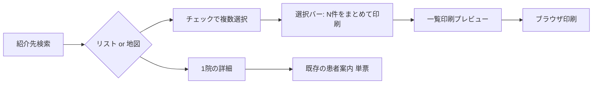

# デザイン案: 逆紹介候補のまとめ印刷

> 対象: foro 連携マップ  
> 目的: 仮説検証ヒアリング用（軽量ワイヤー）  
> 作成日: 2026-07-14  
> 要件: [要件_逆紹介候補先まとめ印刷.md](../2_discovery/要件_逆紹介候補先まとめ印刷.md)  
> ワイヤーHTML: `Flow/202607/2026-07-14/Product_連携マップデザイン作成/wireframes_まとめ印刷.html`

---

## 結論（推奨案）

**案A「検索結果から複数選択 → 一覧印刷プレビュー（1ページ最大4件）」を第1候補にする。**

| 判断 | 理由 |
|------|------|
| 印刷は「一覧ページ」 | Notion追記どおり枚数削減。がん研の「持ち帰って比較」にも向きやすい |
| 選択はリスト・地図 **両方** | 現UIが両タブ併存。新東京は効率、がん研は候補が多いため両方の導線が要る |
| 既存「患者案内」は残す | 1院確定時の詳細印刷は現状維持。用途を分ける |
| 印刷専用画面 | 検索一覧の項目見直しは別チケットのため、患者向け情報は別画面に載せる |

---

## ユーザーフロー（推奨）

---

## 案の比較

### 案A（推奨）: 複数選択 → 一覧印刷

| 画面 | 内容 |
|------|------|
| 検索結果（リスト） | 各行にチェックボックス。フッターに選択数 +「まとめて印刷」 |
| 検索結果（地図） | ピン/サイドリストにチェック。同じ選択バー |
| 印刷プレビュー | A4縦・**1ページ最大4件**。施設名 / TEL / 住所 / 簡易マップ or QR / アクセス要約 |
| 詳細との関係 | 詳細の「患者案内」はそのまま。選択解除・件数上限あり |

**Pros**: 印刷枚数が減る / 比較しやすい / フローが短い（メディグル寄り）  
**Cons**: 1件あたりの情報量が単票より薄い → 項目の優先順位をヒアリングで決める必要あり

### 案B: 複数選択 → 既存患者案内を連続印刷

選択したN件分の単票を1つの印刷ジョブにまとめる（ページ送りでN枚）。

**Pros**: 情報量は現状どおり / 実装が比較的素直  
**Cons**: 4候補で4枚。新東京の「無駄な印刷を減らす」に弱い。持ち帰りの束が厚い

### 案C: 「印刷用に追加」トレイ方式

詳細 or リストからトレイに貯め、トレイからまとめて印刷（一覧 or 単票を選べる）。

**Pros**: ページ跨ぎ選択に強い / 一覧・単票の使い分けを明示できる  
**Cons**: UIが増え、半日40〜60人を診る現場では一手間多い可能性

---

## 画面詳細（案A）

### 1. 選択UI

- **リスト**: 行左端にチェック。行クリックは従来どおり詳細へ。チェックは別操作（誤タップ防止）
- **地図**: サイドパネルの施設行にも同じチェック。マップ上の選択ピンはチェック同期
- **選択バー**（画面下部固定）
  - 「3件選択中」
  - 主要CTA:「まとめて印刷」
  - 副次:「選択解除」
  - 0件時はバー非表示 or CTA無効
- **件数上限（案）**: まずは **8件（=2ページ）** を仮置き。超過時はアラート。ヒアリングで確定

### 2. 印刷プレビュー（患者向け一覧）

ヘッダー（全ページ共通・小さく）:
- 「紹介候補のご案内」（仮ラベル・テナントカスタムは後続）
- 印刷日

各カード（1/4ページ）に載せる項目案:

| 優先 | 項目 | 根拠 |
|------|------|------|
| Must | 医療機関名 | 必須 |
| Must | 電話番号 | 予約・確認 |
| Must | 住所 | 来院 |
| Must | 地図（縮小）または Google Maps QR | がん研: 地図不足が指摘 |
| Should | 交通アクセス（1〜2行） | 持ち帰り検討 |
| Should | 駐車場 あり/なし | 単票にもある |
| Could | 予約診療 あり/なし | 単票にもある |
| No | 逆紹介数 | VoC: 患者向けには不要／過情報 |

意図的に載せない:
- 逆紹介数・院内向け統計
- 詳細版に近い長い診療時間表（スペース制約。必要なら単票へ誘導）

フッター:
- 「最新の診療時間・休診は事前にご確認ください」（既存単票と同趣旨）
- 「詳しい案内が必要な施設は、個別の患者案内もご利用ください」（運用メモ。印刷物からは省略可）

### 3. 既存単票との使い分け（併存方針）

| 場面 | 使うもの |
|------|----------|
| 候補を複数渡して持ち帰ってもらう | **まとめ印刷（一覧）** |
| 1院に決まった / 詳しく渡したい | **既存 患者案内** |
| さらに詳細（レガシー） | **患者案内（詳細版）** |

UIコピー案（詳細画面のボタン群）:
- 患者案内 … 変更なし
- （新）「印刷用リストに追加」は案C採用時のみ。案Aでは検索結果からのみ選択し、詳細には増やさない（効率・学習コスト）

---

## ヒアリングで聞きたいこと

1. 一度に渡す候補は何件くらい？（目安: 2 / 4 / 8）
2. 一覧で足りる情報は？地図は必須か、QRだけでよいか
3. 選択はリストだけで足りるか、地図からも欲しいか
4. 一覧と単票のどちらを主に使うか（併存で混乱しないか）
5. 1ページ4件の密度は読みやすいか（高齢者への渡しやすさ）

---

## 次のステップ

1. ワイヤーHTMLをがん研・新東京（または連携室）に見せて案A中心にヒアリング
2. 項目・件数上限を確定 → プロトタイプ精度を上げる
3. 実装見積（選択状態管理 / 印刷CSS / 地図・QRの一覧密度）
