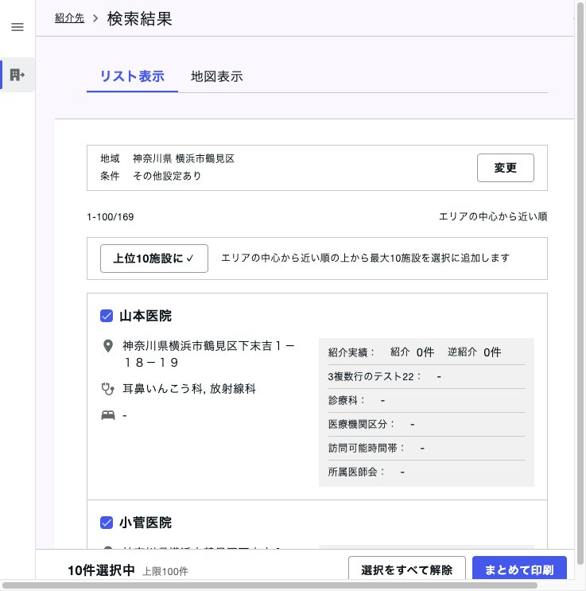
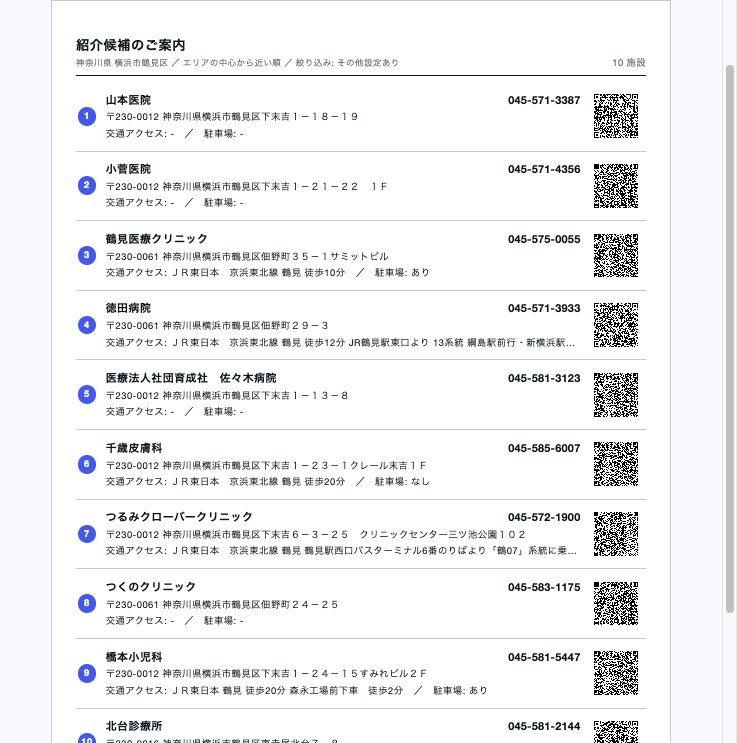
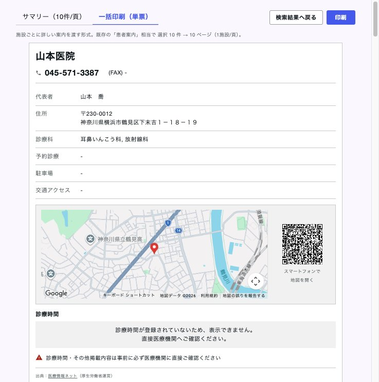

# リリースノート - 【連携マップ】紹介施設のまとめ印刷

> 掲載先: [foroCRM リリースノート](https://app.notion.com/p/medup/95fbdee4aab141168ac72483f4271b23?v=2ee79627fbd749bb92879636b872802a)
> プロダクト: foro 連携マップ
> リリース日: 未定（ステージング検証済み。Notion 転記前のローカル草案）
> バックログ: https://app.notion.com/p/35a1da5a7f3b80d2a925e8454f4c71bf
> PR: https://github.com/MedUpInc/medup-core-service/pull/4816

# 新機能概要

連携マップの検索結果から、複数の医療機関を選んでまとめて印刷できるようにします。これまでは候補ごとに詳細画面を開き、患者案内を1枚ずつ印刷していました。

## 使い方

1. 紹介先を検索する
2. 検索結果（リスト、または地図のサイドパネル）で、渡したい施設にチェックを入れる
3. 画面下に「N件選択中」と「まとめて印刷」が出る
4. 印刷プレビューで形式を選び、「印刷」を押す（ブラウザの印刷ダイアログが開く）

近い順などで案内しているときは、「上位10施設に✓」で並びの上から最大10施設をまとめて選べます。医療機関名で検索しているときは、このボタンは出ません。

## 印刷の形式

プレビュー上部のタブで切り替えます。選んだ形式は、同じ端末では次回も引き継がれます。

| 形式 | 向いている場面 | 中身 |
|------|----------------|------|
| サマリー（10件/頁） | 自分で詳細を確認できる患者に、候補を少なめの枚数で渡す | 1ページ最大10施設。番号、医療機関名、電話番号、郵便番号・住所、交通アクセス、駐車場、GoogleマップのQR。施設ごとの地図は載せず、QRから開く。ページ上部に検索条件 |
| 一括印刷（単票） | 何をすればよいか分かる案内を、施設の数だけ渡す | 既存の患者案内に相当する1施設1ページ。選択した件数ぶん印刷される |

一度に選べるのは最大100件です。

# 課題

患者に紹介先を複数件印刷して渡すとき、施設ごとに詳細ページを開き、その都度印刷する手間がかかっていました。

- 新東京病院（連携室）: 診察の合間に、近い順の上から案内している。候補ごとに印刷する手間を減らしたい
- がん研有明病院（連携室）: 窓口や診察室で1院に絞り切れず、複数候補を持ち帰ってもらう。単票を繰り返し出す工数が重い。診療圏が広いケースで特に困っていた

# 提供価値

- 検索結果から選んで、1回の操作で複数施設を印刷できる
- サマリーなら、10施設までを1枚にまとめられる
- 一括印刷なら、施設数ぶんの詳しい案内をまとめて出せる
- 「上位10施設に✓」で、近い順の上から案内する作業を短くできる

# Appendix

- バックログ: [連携マップ_逆紹介候補先の一覧をまとめて印刷したい](https://app.notion.com/p/35a1da5a7f3b80d2a925e8454f4c71bf)
- 実装: [PR #4816](https://github.com/MedUpInc/medup-core-service/pull/4816)（2026-10-01 に develop へマージ）
- ステージング: https://outpatient.medup-foro-stg.com/reverse-referrals-map （2026-10-02 に動作確認済み。実印刷はこれから）
- 「上位10施設に✓」は、いまの選択に最大10件を追加する。すでに選んでいる施設は残る。医療機関名検索では出さない
- 「選択をすべて解除」で選択を空にできる。0件のときは画面下のバーは出ない
- 地図を動かして再検索しても、選んだ施設は印刷対象に残る
- 一括印刷は、各地図の読み込みが終わるまで「印刷」は押せない。読み込めなかった地図があるときは、件数を出して確認を促す
- スコープ外: 候補リストのSMS送信、検索一覧画面の情報項目の見直し
