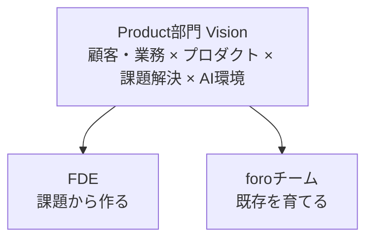

# Product部門方針

> **同期元（正本）**: [Notion — Product部門方針](https://www.notion.so/medup/Product-38fc2423e1d94e39a2c77b747d04b89e)  
> **最終同期**: 2026-05-20  
> **Notion反映**: 反映済（2026-05-20 — §2 探索/継続・一言・まとめ）

---

> **目的**: Product部門の現状理解を踏まえ、組織図（人・役割）と運営方針（会議体・意思決定・優先順位）の**たたき台**を作る。

## 1. 前提：現状理解（一次情報）

### 1-1. 組織図（Product部門の人・役割）

- 参照: [組織図（Notion）](https://www.notion.so/c2658a0d5e354560b8a161ae0428c58c)

#### 1-1-0. チーム構成（現状）

- Product部門の下に「デザイン」「エンジニアリング」の2チームがある

#### 1-1-1. 人・役割一覧（たたき台）

| 名前 | 役割 |
|------|------|
| 三保谷 | デザイナー |
| 康 | エンジニア |
| 新保 | エンジニア |
| 小林 | エンジニア |

#### 1-1-2. PdM（現状）

- 吉田(CS)、三原(BizDev)

### 1-3. 現状の運営（会議体・意思決定・開発フロー）

- **定例／夕会／スプリント運営**: 朝会・夕会（どちらもEMがファシリテーション）
- **意思決定の場**: 開発優先の意思決定は朝会・夕会では行わず、PDM主体の不定期MTGで決まる
- **優先順位の決め方**: PDM主体で決めている（不定期MTG）
  - PDM：吉田、三原
  - 主なインプット：顧客要望（CS経由）がメイン

### 1-4. 現状の課題

- エンジニアリングチームがEMのスキル・判断に依存している範囲が大きく、チームというより1対1の集まりになっている
- プロダクト/業務理解にばらつきがあり、判断・議論の前提が揃いづらい（一次情報に触れる量や観点に差が出やすい）
- デザイナーが単独体制（産休予定）で、継続的な改善・運用を回す設計が未確定

### 1-5. CSE/DataOps（現状メモ）

- **業務**: データクレンジング＆インポート等の定例オペレーションが中心
- **コミュニケーション**: CSメンバーとの調整が多い
- **リーダー**: 黒川（AI DPCチームを兼務）

## 2. プロダクト部門のあるべき姿

### 2-0. Mission / Vision

#### 会社（全社）

| | 文言 |
|---|------|
| **Mission** | 医療の可能性をテクノロジーで開放する |
| **Vision** | 経営から病院を変える、病院から医療を変える |

#### Product部門 Vision

> **顧客や業務に深く入り込み、プロダクトを活用・構築して課題解決までをやり切れるProduct部門**を目指す。  
> そのために **AIを活用した高効率な開発環境**を部門全体で整える。  
> **既存プロダクト（foro等）の維持・改善にも責任を持ち**、探索と継続の**どちらも欠かさない**。

**文案（コピー用）**

```text
顧客や業務に深く入り込み、プロダクトを活用・構築して課題解決までをやり切れるProduct部門を目指す。
そのためにAIを活用した高効率な開発環境を部門全体で整える。
既存プロダクト（foro等）の維持・改善にも責任を持ち、探索（FDE）と継続（foroチーム）のどちらも欠かさない。
```

| 層 | 内容 |
|----|------|
| **部門の姿（共通）** | 顧客・業務理解 × プロダクト活用・構築 × 課題解決まで完遂 |
| **手段（共通）** | AI駆動開発環境 — 部門全体の生産性基盤 |
| **探索** | **FDE** — 顧客の現場で課題を見つけ、整理し、実装まで届ける |
| **継続** | **foroチーム** — 既存SaaSを安定運用し、改善でユーザー成長を担う |

#### 二層の関係（イメージ）



```
        Product部門 Vision（全体）
    顧客・業務 × プロダクト × 課題解決完遂 × AI環境
              │
    ┌─────────┴─────────┐
    │                   │
  FDE               foroチーム
  課題から作る        既存を育てる
  （外せない）        （外せない・責任を持つ）
```

- **FDE**（探索）: 顧客の現場で課題を見つけ、整理し、実装まで届ける（セールス・CSと顧客対話 → コンサル × エンジニア）
- **foroチーム**（継続）: 既存SaaSを安定運用し、改善でユーザー成長を担う
- **AI環境**: 探索にも継続にも効く部門共通の基盤

※ **継続**は現状維持だけでなく、既存プロダクトの改善とユーザー成長まで含む。

| 要素 | 部門での意味 |
|------|-------------|
| 課題解決までやり切る | **部門全体**の仕事の仕方 |
| 病院に深く入り込むAI | 探索（主にFDE） |
| 持続可能なSaaS | 継続（foroチーム） |
| 両立 | 探索を進めながら**既存を疎かにしない** |

#### 接続（説明用・1段落）

全社 **Mission** を Product部門がプロダクトで実装する。**探索**はFDEが現場と共に深い課題へ、**継続**はforoチームが既存プロダクトを止めず改善し続ける — どちらも「顧客・業務に向き合い、プロダクトで届ける」という**同じ部門Vision**の両輪。AI環境は、探索にも保守にも効く**部門共通の基盤**。

#### 一言で言うと

> **「顧客の課題を見つけ作る（FDE）と、既存プロダクトを育てる（foro）— Productが両方担う。」**

---

### 2-0-1. 部門Vision 深掘り（参考）

> Vision本文は **§2-0**。本節は議論・説明用の展開メモ。

> **対象**: Product部門全体のVision（FDE専用ではない）。  
> 二層（FDE / foroチーム）は、**同じVisionを実現する2つの担い手**。

#### 文の構造（何が書いてあるか）

```
[部門Vision] 顧客・業務に深く入り、プロダクトで課題解決までやり切る + AI高効率環境
        │
        ├── [探索] FDE → 病院に深く入り込むAI 等
        └── [継続] foroチーム → 既存foroの安定運用・改善・ユーザー成長
        ↓
全社 Mission / Vision を Product が実装する
```

##### Visionの読み解き

| 問い | 答え |
|------|----------------|
| FDEだけの話？ | **いいえ** — 部門全体のあり方。FDEは「深い探索」の担い手 |
| 保守は二の次？ | **いいえ** — foroチームが**部門として責任を持つ**柱。探索・収益の足場 |
| AI環境は誰のもの？ | **部門全体** — FDEもforoチームも使う共通基盤 |

| フレーズ | 問い | 深掘りの焦点 |
|---------|------|-------------|
| 現場と共に | 誰と、どこで、何をもって「共に」か | 顧客MTG・一次情報・PdMペア |
| 課題を見つけ | 何を「課題」と呼ぶか | 要望 vs 本質課題、発見プロセス |
| 実装まで届ける | どこまでがFDEの責務か | 改修・リリース・効果確認の境界 |
| FDE | 誰が・何人で・何を担当か | 保守チームとの分離、黒川兼務 |
| 自律スクラム | 「自律」の定義は | EM依存からの脱却、具体行動 |
| foroを安定運用 | 安定の定義は | SLA・リリース頻度・障害・要望対応 |
| 病院に深く入り込むAI | 「深い」とは何か | データ・ワークフロー・現場プロセス |
| 持続可能なSaaS | 何が持続可能性か | 利益率・人員・技術負債・機能の取捨選択 |
| 両立 | トレードオフをどう扱うか | 配分・優先度・説明責任 |

---

#### ① FDE — 部門Visionの「探索」

**FDEの位置づけ**

顧客の現場で課題を見つけ、整理し、実装まで届ける。部門Visionのうち、**より深い顧客接点・新規課題**を主に担うチーム。北極星は部門と同じだが、**現場MTG・探索・AI新規**にリソースを寄せる。

**FDEとは（この文脈での定義）**

Forward Deployed Engineer — 部門Visionを、**顧客の現場に寄り添う形**で実現するエンジニア。バックログ消化だけの「保守」とは**役割分担が違う**（保守の価値を否定するわけではない）。

| キーワード | 意味 | やること | やらないこと |
|-----------|------|----------|--------------|
| **顧客・業務に深く入り込む** | 病院・現場・経営の文脈を自分の言葉で語れる | 顧客MTG、現場ヒアリング、業務フロー理解、PdMとペア | 仕様書・チケットだけから実装 |
| **プロダクトを活用・構築** | foro等を**手段**として使い、足りなければ作る | 既存機能の組み合わせ、改修、新機能・AIの実装 | 無関係な技術実験だけ |
| **課題解決までやり切る** | 「リリースした」で終わらない | 効果確認・次の課題まで含めた完遂 | 調査・PoCだけで止める |
| **AIで高効率** | 深い仕事に時間を使うための**環境** | AIコーディング、テンプレ、レビュー効率化 | 人数増でカバーするだけ |

**典型フロー（foro入退院の例）**

```
顧客MTG（三原＋FDE）→ 現場の困りごとを構造化 → プロダクト改修案
    → 実装・リリース → 現場で効いているか確認 → 次の課題へ
```

**FDEに求める能力（部門Visionの探索として）**

| 能力 | 具体 |
|------|------|
| 顧客・業務理解 | 現場の言葉で課題を語り、優先度の根拠を説明できる |
| プロダクト思考 | 既存foroで足りるか／改修か／新規かを判断できる |
| 課題解決の完遂 | リリース後も「効いたか」まで見る |
| 実装・技術判断 | AI支援下で設計〜実装まで回す（単独の全スタック完結は必須としない） |
| 協働 | PdM/CSとペア（単独ヒーローにしない） |

**AI駆動開発環境 — 部門共通（§2-0 参照）**

FDE・foroチーム**どちらも**使う。探索に時間を使うにも、保守を少人数で回すにも必要。

| 領域 | 整えるもの | 担当イメージ |
|------|-----------|-------------|
| **ツール** | Cursor等、AIコーディング、プロンプト・テンプレ | テックリード or 有志 |
| **プロセス** | 仕様→実装→レビューのAI前提フロー、品質ゲート | **部門横断** |
| **基盤** | CI、ステージング、デモデータ | 馬場 + エンジニア |
| **スキル** | AI出力の検証の型 | foroチーム・FDEとも |

→ §3-1 の**テックリード**は「**部門の**AI環境をリードする役」。

**現状との差分（§1-4）**

| 現状 | FDEあるべき |
|------|------------|
| CS経由の要望が主入力 | **顧客・業務**が主入力 |
| 開発タスク優先の文化 | **課題解決完遂**優先（深く入る時間を確保） |
| 保守チームに混在しがち | **別枠**で育成 |
| AI未整備・人数で回す発想 | **AI環境**で少人数高効率 |

**[要議論]**

- [ ] FDEの**最初のプロダクト範囲**（入退院 only / AI DPC / 新規事業）
- [ ] **黒川さん兼務**の位置づけ（メインFDE vs DataOps）
- [ ] **1人目FDE**の採用時期と、foroチームとの人員境界
- [ ] **AI環境の90日ゴール**（何が揃えば「高効率」と言えるか）
- [ ] 成功指標: 完遂した課題解決○件/年、顧客フィードバック、リリース後の効果

---

#### ② foroチーム — 部門Visionの「継続」

**foroチームの位置づけ**

既存SaaSを安定運用し、改善でユーザー成長を担う。部門Visionのうち、**既存プロダクト（foro等）の維持・改善にちゃんと責任を持つ**担い手。  
「探索（FDE）の影」ではなく、**部門として外せない半分**。

**foroチームとは**

foroシリーズの**既存顧客価値**を、PdM/CSと連携しながら**止めず・信頼を損なわず・必要な改善を届け続ける**チーム。部門Visionの「プロダクトを活用して課題解決」は、ここでは主に**既存病院の継続的な課題・要望・品質**として現れる。

| キーワード | 意味（たたき台） | やること | やらないこと |
|-----------|----------------|----------|--------------|
| **自律スクラム** | 優先度以外はチームが回す | 設計・見積・スプリント計画・デイリー・振り返り | EM/山田の日次タスク割り当て |
| **foro** | 既存顧客価値の本体 — **部門が責任を持つ** | バグ・改善・要望・リリース・運用 | 放置・「FDEだけ頑張ればいい」 |
| **安定運用** | ちゃんと責任を持つ具体 | 定例リリース、障害対応、技術負債の管理 | 無秩序な差し込み・属人化 |
| **部門Visionとの接続** | プロダクトで顧客課題に応える（PdM/CS経由＋チーム自律） | 単なるコストセンター化 |

**「自律」の具体像（§1-3・§3-1から）**

| 領域 | 現状 | 自律後 |
|------|------|--------|
| 優先度 | PdM不定期MTG | 同左（チームは決めない） |
| 設計・スケジュール | EMが細かく指示 | **チームが提案し、可視化** |
| 進捗 | 1対1依存 | **デイリーでチーム共有**、マネージャーは障害除去 |
| 責任 | 曖昧になりがち | スプリントゴール・担当の明確化 |

**「安定」の具体像（[要定義])**

- リリース: 週次/隔週など**リズムが固定**
- 障害: 対応SLA・エスカレーション経路が明文化
- 要望: PdM/CS経由で**バックログ化**、口頭差し込みを減らす
- 技術: 技術負債の可視化と**意図的な返済枠**

**現状との差分**

| 現状（§1-4） | あるべき |
|-------------|---------|
| EMスキル・判断に依存 | foroチームリード（康）の**チーム判断** |
| 1対1の集まり | スクラムとしての**共同責任** |
| プロダクト理解のばらつき | デイリー・レビューで**前提共有** |

**[要議論]**

- [ ] 「安定」の数値定義（リリース遅延率、P0件数 など）
- [ ] 康の役割: スクラムマスターか、テックリード兼務か
- [ ] 新保・小林の期待役割の明文化（§3まとめは空欄）
- [ ] FDEへの「応援」はどこまで許容するか（スコープクリープ防止）

---

#### ③ 病院に深く入り込むAI（探索・目的X）

**このフレーズが指すもの**

- **病院**: 顧客（済生会、現場の医師・事務・経営）の実ワークフロー
- **深く入り込む**: 表層の機能追加ではなく、**業務プロセス・データ・意思決定**に入り込む（＝北極星の「顧客・業務に深く入り込む」）
- **AI**: 現場課題に紐づいた**AIプロダクト／機能** — プロダクトを構築・活用する対象のひとつ

| レベル | 浅い | 深い（目指す） |
|--------|------|----------------|
| 接点 | 要望対応・画面追加 | 現場課題の構造化と検証 |
| データ | 集計・レポート | 業務に効くデータ統合・分析 |
| AI | 汎用機能の搭載 | **その病院の意思決定・行動**を変える |

**部門Visionとの関係**

- **病院に深く入り込むAI**は、部門Visionの**探索側の成果**（主にFDE）。
- **AI駆動開発環境**は**部門全体**の手段（FDE・foroチーム共通）。

**全社Visionとの接続**: 「**病院から医療を変える**」— 臨床・現場プロセス側の変革。

**[要議論]**

- [ ] 最初の「深い」スコープ: 1病院深掘りか、横展開か
- [ ] AIとforo既存データの**接続方針**（foroチームとの境界）
- [ ] 成功の定義: 導入病院数 vs 1病院での変容深度

---

#### ④ 持続可能なSaaS事業（収益・目的Y）

**このフレーズが指すもの**

- **SaaS**: foroシリーズ等の**サブスクリプション型**既存事業
- **持続可能**: 探索投資（FDE/AI）を支える**利益・キャパ・品質**が維持できる状態
- 本文の方針: **新機能は絞る**、**効率的な保守運用**で利益率を上げる

| 持続可能性の柱 | foroチームの貢献 |
|---------------|---------------------------|
| **経済** | 開発・運用コストを抑え、ARPU・解約を守る |
| **運用** | 安定リリース、障害少、CS/PdMが信頼できる |
| **技術** | 技術負債・AI開発基盤を管理（テックリード論点） |
| **組織** | 少人数（AI駆動）で回るチーム設計 |

**「持続可能」と「機能を絞る」の関係**

```
要望が増える → 全部やらない → PdMが優先度決定
    → foroチームが予測可能に届ける → 余力・利益が FDE/AI に回る
```

**全社Visionとの接続**: 「**経営から病院を変える**」— 病院経営・運営に効くSaaSを**止めずに届け続ける**。

**[要議論]**

- [ ] 「機能を絞る」の判断基準（ROI、戦略、顧客セグメント）
- [ ] 保守チームの**人数上限**イメージ
- [ ] 解約・障害・リリース遅延など、**継続のKPI**

---

#### ⑤ 両立 — 二層で2つの目的を同時に追う

**なぜ「両立」がVisionに入るか**

- 要望対応だけに寄ると → AI/探索が止まる
- 新規だけに寄ると → 既存顧客・収益が毀損する
- **組織を分けても、人・優先度・マネージャー時間は共有** → 意識的な設計が必要

**トレードオフとルール（たたき台）**

| 状況 | 原則 |
|------|------|
| 差し込み・障害 | foroチーム優先（ただしFDEを全員取らない） |
| 新規AIの探索 | FDEに専念時間を確保（スプリントに載せない文化） |
| 人員 | まずforoチームを自律化 → 浮いたマネジメント工数をFDEへ |
| 説明 | 「なぜ今期これをやらないか」を**探索vs収益**で説明できる |

**両立のガバナンス（[要設計]）**

- **誰が配分を決めるか**: 山田（部門マネージャー）+ PdM（吉田・三原）
- **いつ見直すか**: 四半期 or 半期で FDE/foroチームの**投資比率**
- **衝突時**: 例）foroチームからFDEへの応援は週○%まで、など

**両立が成功しているサイン**

- [ ] foroのリリースが遅延・品質悪化していない
- [ ] FDEが年間○件「現場課題→リリース」を出している
- [ ] 「全部やれ」と言われたとき、**取捨選択の理由**を説明できる
- [ ] エンジニアが「自分は今どちらのミッションか」を説明できる

---

#### ⑥ 深掘りの次の一手（議論の順番）

1. **③ 病院に深く入り込むAI** — 最初の1プロダクト・1病院を決める（FDEのスコープが決まる）
2. **④ 持続可能なSaaS** — 「安定」「絞る」の定義とKPI
3. **② 自律スクラム** — foroチームの90日ゴール（§3-1と一体）
4. **① FDE** — 1人目・黒川役割・PdMペア
5. **⑤ 両立** — 今期の投資比率（例: foroチーム70% / FDE30%）

**あなたのメモ欄**

```
・北極星: Product部門全体 — 深い課題解決 + 既存プロダクトへの責任 + AI環境
・病院に深く入り込むAI について:
・持続可能なSaaS について:
・FDE / foroチームの境界について:
・AI環境の90日ゴール:
・今期の配分イメージ:
```

---

### 2-1. 一言で言うと

**「顧客の課題を見つけ作る（FDE）と、既存プロダクトを育てる（foro）— Productが両方担う。」** — §2-0 参照。

---

### 2-2. 事業・プロダクトの前提（Why）

| 軸 | あるべき姿 | 部門への意味 |
|----|-----------|-------------|
| **探索** | 病院に深く入り込むAI（病院から医療を変える） | 現場理解 → 仮説 → 実装 → **FDE** |
| **継続** | 既存SaaS（foro等）の安定運用・改善・ユーザー成長（経営から病院を変える） | **foroチーム** |
| **コスト** | 少人数で回す（AI駆動開発） | 二層構成 + AI前提の生産性 |

**[要記入]** セグメント・VP・ユーザー数・コストの定量イメージ

---

### 2-3. Product部門が担うこと（What）

部門Visionの**2本柱**（どちらも欠かせない）:

1. **既存プロダクトの維持・改善に責任を持つ**（foroシリーズ等）— **foroチーム**、PdM/CSと連携
2. **深い顧客課題への挑戦**（AI、新領域）— **FDE**、顧客接点から逆算
3. **プロダクト品質の土台**（デザイン、インフラ/セキュリティ）— 両方を支える
4. **AI駆動開発環境** — 部門共通の生産性基盤

※ CSE/DataOps は開発本体ではなく定例オペ中心 → §3-2 のとおり **CS配下維持**が筋が通る。

---

### 2-4. 目指す組織像（How）— 2チーム構成

現状の「エンジニアリング1塊」を、**役割で分ける**（別チームとして育てる）。

```
┌─────────────────────────────────────────────────────────┐
│                    Product部門                           │
├──────────────────────┬──────────────────────────────────┤
│  A. foroチーム         │  B. FDE（Forward Deployed）       │
│     ・維持・改善に責任 │     ・顧客理解 → 解決策 → 実装    │
├──────────────────────┼──────────────────────────────────┤
│ 対象: foro等既存SaaS  │ 対象: 新規AI・深い現場課題        │
│ 入力: PdM/CSの優先度  │ 入力: 顧客MTG・現場の一次情報      │
│ 成功: 自律スクラムで   │ 成功: 課題発見とプロダクト改修まで │
│       安定リリース     │       一気通貫（PdMとコンビ）      │
│ メンバー: 康/新保/小林 │ メンバー: FDE新規＋黒川(兼務)等    │
│ リード: 康（スクラム） │ 例: 三原×foro入退院の顧客MTG      │
└──────────────────────┴──────────────────────────────────┘
         ↑ デザイン・インフラは横断で支援
```

#### A. foroチーム — 継続

- **部門Visionにおける役割**: 既存foroの**維持・改善にちゃんと責任を持つ**（§2-0）
- **あるべき状態**: 自律スクラムで安定運用 — EM日次割り当てから脱却（§1-4）
- PdM/CS が優先度、チームが設計〜リリースまで自律的に実行
- 「保守」＝消極的維持ではなく、**顧客価値を止めない部門の責務**

#### B. FDE — 探索

- **部門Visionにおける役割**: より深い顧客接点から**新しい課題解決**（§2-0）
- 現状のforoチームとは **別枠**（開発タスク優先文化の混在を防ぐ）
- PdM（例: 三原）とペアで顧客MTG → 改修〜効果確認
- AI環境は部門共通（§2-0-1）、テックリードは §3-1

#### 横断（デザイン・インフラ）

- デザイン: 産休・業務委託移行期を経て、PdM主導の要件 + デザイナー実装の型を確立（§3-3）
- インフラ/セキュリティ（馬場）: 両チームの土台

---

### 2-5. 設計原則（判断に使う）

| # | 原則 | やること | やらないこと |
|---|------|----------|--------------|
| 1 | **顧客・業務に向き合う** | FDEは現場MTG。foroチームはPdM/CSと顧客課題を共有し品質で応える | 部門として顧客から遠ざかる |
| 2 | **課題解決まで** | リリースで終わらない（改善の効果・障害の収束） | チケット消化だけ |
| 3 | **既存に責任** | foro維持・改善を疎かにしない | 「新規だけ頑張ればいい」 |
| 4 | **二層投資** | FDE（探索）とforoチーム（継続）を意識的に配分 | 一方に全振り |
| 5 | **AI前提の生産性** | **部門全体**でAI駆動環境を整え、使う | 人数増だけで解決 |
| 6 | **チーム自律** | foroチームは優先度以外をチームで回す | EMの日次割り当て |

**[要記入]** 「重視しないこと」（§3まとめ）— 例: 機能数だけの成功指標、EM依存の進捗管理 など

---

### 2-6. 現状課題（§1-4）への当てはめ

| 現状の課題 | あるべき姿での答え |
|-----------|-------------------|
| EM依存・1対1集まり | Aチームを自律スクラムへ。EMは障害除去・境界設定 |
| プロダクト理解のばらつき | FDEは顧客接点必須。Aはデイリーで前提共有・可視化 |
| デザイナー単独・産休 | 業務委託 + 資産引き継ぎ。PdMが要件を厚く持つ期間を設計 |

---

### 2-7. まだ煮詰めること（§3・議論用）

**整理済み**

- [x] **部門Vision** — §2-0（全社 Mission / Vision 接続済み）

**これから**

- [ ] **FDE / foroチームのリソース配分** — 今期の人数・%（FDEは何人目から立ち上げるか）
- [ ] **FDEの最初のスコープ** — foro入退院のみか、AI DPCとの関係（黒川兼務の整理）
- [ ] **テックリード** — 採用するか、康+外部で足りるか（§3-1）
- [ ] **「顧客視点が弱いエンジニア」をAに置くか** — 許容ライン
- [ ] **成功指標** — A: リリース安定・リードタイム / B: 顧客課題→リリース件数 など

---

## 3. 決めたいこと

- エンジニアチームの責務・運営方針
- CSE/DataOpsの所属
- 三保谷さん産休に伴うデザインチームの方針・構成

### 3-1. エンジニアチームの運営方針

- **エンジニア**: 康／新保／小林

**現状組織・メンバーに求めたいこと**

- スクラム開発のサイクルをチームメンバーで回せる状態
  - 開発テーマの優先度まではPdMやCSで決める → チケット起票
  - それ以降の設計、スケジューリング等を主体的に実行できるチーム
  - 定例タスク、差し込みタスクを把握して主体的に実行できるチーム
    - ※現状EMが日々細かく作業指示している

**想定される課題**

- 不明点を担当者・チーム内で抱えて時間を無駄にする
- チームタスクの責任が不明確になる
  - デイリーMTGでの情報共有でマネージャーに対して課題進捗を可視化させる

**技術面の懸念**

- 顧客視点重視のエンジニアなため、技術的側面が不安（スキル的にも稼働時間も）
  - **テックリードポジションの採用**
    - AI駆動開発の環境構築をリードできる人材
    - 現メンバーでフォロー可能であれば不要だが、難しいのではないか
    - 顧客視点の低いエンジニアであっても許容するか？？

### 3-2. CSE/DataOpsの所属

- **CSE/DataOpsはCS配下のままが良さそう**

**背景/理由**

- 業務の中心がデータクレンジング＆インポート等の定例オペレーションで、Product部門の開発業務とは切り離されている
- エンジニア、デザイナーよりCSメンバーとの接点の方が多く、CS配下の方が運用優先度・責任分界が明確

- 黒川さんのマネジメントは山田（ならproduct配下でもよくないか？）

### 3-3. 三保谷さん産休に伴うデザインチームの方針・構成

- 三保谷さん **7月中旬から産休予定**

**決めること**

- **体制**: 採用/業務委託 どちらで埋めるか？
  - → **業務委託でいく**
  - 現状と比較して(PdMが)詳細にデザイン案を起こす必要が出てくると想定
- **ナレッジ**: デザイン資産（Figma等）の整理・引き継ぎのやり方
  - 三保谷さん整理中
  - 直接後任へ引き継ぐためには **7月初には要参画**

## 3. まとめ

- **部門Vision**: §2-0 — 課題を見つけ作る（FDE）と既存プロダクトを育てる（foroチーム）、AI環境は部門共通
- **二層**: FDE（探索）／ foroチーム（継続）
- **全社**: Mission / Vision → §2-0 接続
- **行動指針**
  - 重視しないこと: （Notion上は未記入）
- **組織図（Google Slides）**: https://docs.google.com/presentation/d/1k-T_br55Zp-2V9tdx-GWbDsXU03IqYTzEbaTb2JPgW8/edit?slide=id.p#slide=id.p

### 各メンバーの期待役割

| 名前 | 担当領域 | 期待役割 |
|------|----------|----------|
| 三保谷 | | 資産整理、引き継ぎ |
| 康 | foroシリーズ保守運用 | スクラムチームのリード |
| 新保 | foroシリーズ保守運用 | |
| 小林 | foroシリーズ保守運用 | |
| FDEエンジニア | | １人目FDE |
| テックリード | | AI駆動開発をリードする |
| データエンジニア | | |
| 黒川 | FDE | メインFDEで新規事業やDataOpsを兼務 |
| 馬場 | | インフラ構成、セキュリティ |
| 山田 | | 部門全体のマネジメント、PdM |

## 8. 参照リンク（Notionのみ・ローカル同期対象外）

- [組織図](https://www.notion.so/c2658a0d5e354560b8a161ae0428c58c)
- [1on1ログ](https://www.notion.so/35f1da5a7f3b80879744d06d960e89a0)
- [開発バックログ](https://www.notion.so/31a1da5a7f3b80069898dccce4aabb1b)
- [リソース計画表（週次）](https://www.notion.so/3641da5a7f3b80b08aefc76adaaf414d)
