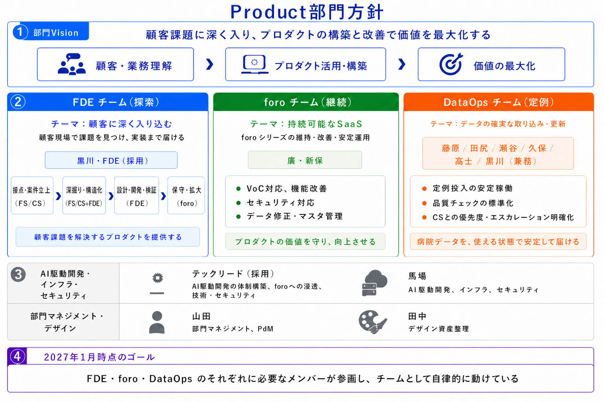
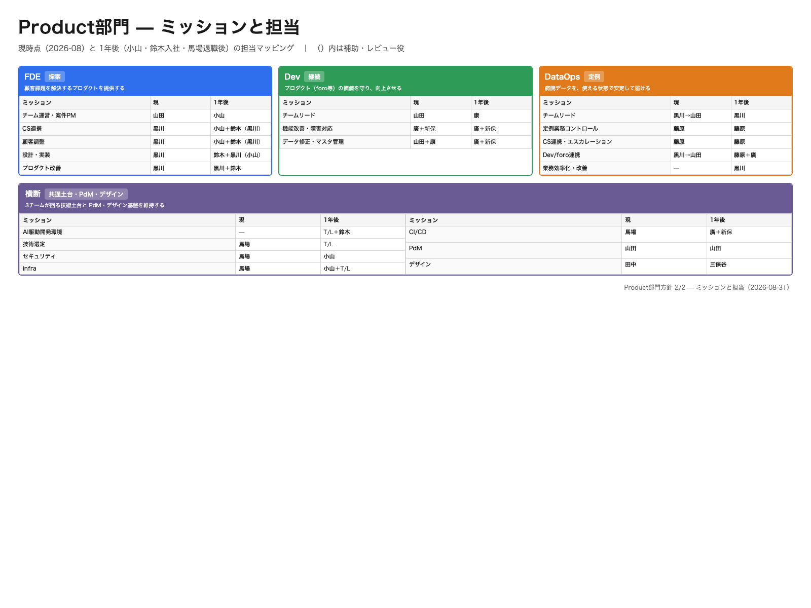

# Product部門方針

> **同期元（Notion）**: [Notion — Product部門方針](https://www.notion.so/medup/Product-38fc2423e1d94e39a2c77b747d04b89e)  
> **ローカル更新**: 2026-09-02（継続チーム名を foroチーム → **Devチーム** に変更。プロダクト名 foro は維持）  
> **Notion反映**: 未反映（指示まで待つ）  
> **サマリー絵**: [1/2 方針・体制](Product部門方針-summary-detailed-3teams.png) / [2/2 ミッションと担当](Product部門方針-mission-mapping.png)  
> **スライド（編集可）**: **Google スライド** — `Product部門方針.pptx` を [Google ドライブ](https://drive.google.com) にアップロードし「Google スライドで開く」（または `upload-to-google-slides.py`） / [PowerPoint](Product部門方針.pptx) / [ブラウザ版](Product部門方針-slides.html)

---

> **目的**: Product部門の**目指す姿**と**体制・方針案**を整理し、たたき台を作る。現状理解は §3 にメモとして後置。





## 1. プロダクト部門の目指す姿

### 1-0. Mission / Vision

### 1-1. Product部門 Vision

**顧客課題に深く入り、プロダクトの構築と改善で価値を最大化する**

> Product部門は、プロダクトを作り・育てることを通じて顧客価値を届ける。  
> 顧客・業務への深い理解は、そのための手段であり、ゴールはプロダクトの価値最大化にある。  
> そのために AIを活用した高効率な開発環境を部門全体で整える。  
> 探索（FDE）・継続（Dev）・定例（DataOps）で価値最大化を分担する。

| 層 | 内容 |
|----|------|
| **部門の姿（共通）** | 顧客課題に深く入り、**プロダクトの構築・改善**で価値を最大化する |
| **手段（共通）** | AI駆動開発環境 — 部門全体の生産性基盤 |
| **探索** | **FDEチーム** — 現場課題からプロダクト価値を新たに届ける |
| **継続** | **Devチーム** — 既存プロダクトの価値を維持・改善し続ける |
| **定例** | **DataOpsチーム** — プロダクトが効く前提のデータを、使える状態で安定して届ける |

#### 1-1-1. 三層の関係（イメージ）

```
        Product部門 Vision（全体）
  顧客課題に深く入り × 構築・改善で価値最大化 × AI環境
                        │
         ┌──────────────┼──────────────┐
         │              │              │
      FDEチーム       Devチーム     DataOpsチーム
      探索・構築       継続・改善      定例データ
```

- **FDEチーム**（探索）: 顧客の現場で課題を見つけ、整理し、実装まで届ける
- **Devチーム**（継続）: 既存SaaSを安定運用し、改善でユーザー成長を担う
- **DataOpsチーム**（定例）: 病院データを使える状態で安定して届ける
- **AI環境**: 3チームすべてに効く部門共通の基盤（テックリード・馬場が推進）

※ 継続は現状維持だけでなく、既存プロダクトの改善とユーザー成長まで含む。

| 要素 | 部門での意味 |
|------|-------------|
| プロダクトの価値最大化 | 部門全体のゴール（構築・改善） |
| 顧客課題に深く入る | 価値最大化のための共通スタンス |
| 持続可能なSaaS | 継続（Devチーム） |
| 使えるデータを届ける | 定例（DataOpsチーム） |

#### 1-1-2. 接続（説明用）

**探索**はFDEが現場課題から新しいプロダクト価値を届け、**継続**はDevチームが既存プロダクトの価値を止めず改善し、**定例**はDataOpsがプロダクトが効く前提のデータを届ける — いずれも「顧客課題に深く入り、プロダクトの構築と改善で価値を最大化する」という**同じ部門Vision**の分担。AI環境は3チームに効く**部門共通の基盤**。

- **探索**: 病院に深く入り、プロダクトで新たに届ける
- **継続**: 既存SaaSの安定運用・改善・セキュリティ確保・ユーザー成長
- **定例**: データの安定投入・品質・CS連携
- **組織**: 少人数 × AI駆動開発

---

### 1-2. 部門Vision 深掘り（参考）

> Vision本文は **§1-1**（2026-08-24更新）。本節は議論・説明用の展開メモ。旧「課題解決までやり切る」前提の記述が残る場合は §1-1 を優先。

> **対象**: Product部門全体のVision（FDEチーム専用ではない）。  
> 三層（FDE / Dev / DataOps）は、**同じVisionを実現する担い手**。

#### 文の構造（何が書いてあるか）

```
[部門Vision] 顧客・業務に深く入り、プロダクトで課題解決までやり切る + AI高効率環境
        │
        ├── [探索] FDEチーム → 病院に深く入り込むAI 等
        └── [継続] Devチーム → 既存foroの安定運用・改善・ユーザー成長
        ↓
全社 Mission / Vision を Product が実装する
```

##### Visionの読み解き

| 問い | 答え |
|------|----------------|
| FDEチームだけの話？ | **いいえ** — 部門全体のあり方。FDEチームは「深い探索」の担い手 |
| 保守は二の次？ | **いいえ** — Devチームが**部門として責任を持つ**柱。探索・収益の足場 |
| AI環境は誰のもの？ | **部門全体** — FDEチームもDevチームも使う共通基盤 |

| フレーズ | 問い | 深掘りの焦点 |
|---------|------|-------------|
| 現場と共に | 誰と、どこで、何をもって「共に」か | 顧客MTG・一次情報・FS／CSと共同 |
| 課題を見つけ | 何を「課題」と呼ぶか | 要望 vs 本質課題、発見プロセス |
| 実装まで届ける | どこまでがFDEチームの責務か | 改修・リリース・効果確認の境界 |
| FDEチーム | 誰が・何人で・何を担当か | 保守チームとの分離、黒川兼務 |
| 自律スクラム | 「自律」の定義は | EM依存からの脱却、具体行動 |
| **foroを安定運用** | Devチームにおける安定の定義は | SLA・リリース頻度・障害・要望対応 |
| 病院に深く入り込むAI | 「深い」とは何か | データ・ワークフロー・現場プロセス |
| 持続可能なSaaS | 何が持続可能性か | 利益率・人員・技術負債・機能の取捨選択 |
| 両立 | トレードオフをどう扱うか | 配分・優先度・説明責任 |

---

#### ① FDEチーム — 部門Visionの「探索」

**FDEチームの位置づけ**

顧客の現場で課題を見つけ、整理し、実装まで届ける。部門Visionのうち、**より深い顧客接点・新規課題**を主に担うチーム。北極星は部門と同じだが、**現場MTG・探索・AI新規**にリソースを寄せる。

**FDEチームとは（この文脈での定義）**

Forward Deployed Engineer — 部門Visionを、**顧客の現場に寄り添う形**で実現するエンジニア。バックログ消化だけの「保守」とは**役割分担が違う**（保守の価値を否定するわけではない）。

| キーワード | 意味 | やること | やらないこと |
|-----------|------|----------|--------------|
| **顧客・業務に深く入り込む** | 病院・現場・経営の文脈を自分の言葉で語れる | 顧客MTG、現場ヒアリング、業務フロー理解、FS／CSと共同 | 仕様書・チケットだけから実装 |
| **プロダクトを活用・構築** | foro等を**手段**として使い、足りなければ作る | 既存機能の組み合わせ、改修、新機能・AIの実装 | 無関係な技術実験だけ |
| **課題解決までやり切る** | 「リリースした」で終わらない | 効果確認・次の課題まで含めた完遂 | 調査・PoCだけで止める |
| **AIで高効率** | 深い仕事に時間を使うための**環境** | AIコーディング、テンプレ、レビュー効率化 | 人数増でカバーするだけ |

**典型フロー（foro入退院の例）**

```
顧客MTG（FS／CS＋FDE）→ 現場の困りごとを構造化 → プロダクト改修案
    → 実装・リリース → 現場で効いているか確認 → 次の課題へ
```

**FDEチームに求める能力（部門Visionの探索として）**

| 能力 | 具体 |
|------|------|
| 顧客・業務理解 | 現場の言葉で課題を語り、優先度の根拠を説明できる |
| プロダクト思考 | 既存foroで足りるか／改修か／新規かを判断できる |
| 課題解決の完遂 | リリース後も「効いたか」まで見る |
| 実装・技術判断 | AI支援下で設計〜実装まで回す（単独の全スタック完結は必須としない） |
| 協働 | FS／CSと共同（単独ヒーローにしない） |

**AI駆動開発環境 — 部門共通（§1-1 参照）**

FDEチーム・Devチーム**どちらも**使う。探索に時間を使うにも、保守を少人数で回すにも必要。

| 領域 | 整えるもの | 担当イメージ |
|------|-----------|-------------|
| **ツール** | Cursor等、AIコーディング、プロンプト・テンプレ | テックリード or 有志 |
| **プロセス** | 仕様→実装→レビューのAI前提フロー、品質ゲート | **テックリード・馬場（部門共通）** |
| **基盤** | CI、ステージング、デモデータ | 馬場 + エンジニア |
| **スキル** | AI出力の検証の型 | Devチーム・FDEチームとも |

→ §2-3 の**テックリード＋馬場**が部門共通のAI環境を推進。AI環境の構築（FDE起点）と、foro側の技術面・セキュリティもリードする。

**現状との差分（§3-3）**

| 現状 | FDEチームのあるべき |
|------|------------|
| CS経由の要望が主入力 | **顧客・業務**が主入力 |
| 開発タスク優先の文化 | **課題解決完遂**優先（深く入る時間を確保） |
| 保守チームに混在しがち | **別枠**で育成 |
| AI未整備・人数で回す発想 | **AI環境**で少人数高効率 |

**[要議論]**

- [ ] FDEチームの**最初のプロダクト範囲**（入退院 only / AI DPC / 新規事業）
- [ ] **黒川さん兼務**の位置づけ（メイン（FDEチーム） vs DataOps）
- [ ] **1人目（FDEチーム）**の採用時期と、Devチームとの人員境界
- [ ] **AI環境の90日ゴール**（何が揃えば「高効率」と言えるか）
- [ ] 成功指標: 完遂した課題解決○件/年、顧客フィードバック、リリース後の効果

---

#### ② Devチーム — 部門Visionの「継続」

**Devチームの位置づけ**

既存SaaSを安定運用し、改善でユーザー成長を担う。部門Visionのうち、**既存プロダクト（foro等）の維持・改善にちゃんと責任を持つ**担い手。  
「探索（FDEチーム）の影」ではなく、**部門として外せない半分**。

**Devチームとは**

foroシリーズの**既存顧客価値**を、PdM/CSと連携しながら**止めず・信頼を損なわず・必要な改善を届け続ける**チーム。部門Visionの「プロダクトを活用して課題解決」は、ここでは主に**既存病院の継続的な課題・要望・品質**として現れる。

| キーワード | 意味（たたき台） | やること | やらないこと |
|-----------|----------------|----------|--------------|
| **自律スクラム** | 優先度以外はチームが回す | 設計・見積・スプリント計画・デイリー・振り返り | EM/山田の日次タスク割り当て |
| **foro** | 既存顧客価値の本体 — **部門が責任を持つ** | バグ・改善・要望・リリース・運用 | 放置・「FDEチームだけ頑張ればいい」 |
| **安定運用** | ちゃんと責任を持つ具体 | 定例リリース、障害対応、技術負債の管理 | 無秩序な差し込み・属人化 |
| **部門Visionとの接続** | プロダクトで顧客課題に応える（PdM/CS経由＋チーム自律） | 単なるコストセンター化 |

**「自律」の具体像（§3-2・§3-1から）**

| 領域 | 現状 | 自律後 |
|------|------|--------|
| 優先度 | PdM不定期MTG | 同左（チームは決めない） |
| 設計・スケジュール | EMが細かく指示 | **チームが提案し、可視化** |
| 進捗 | 1対1依存 | **デイリーでチーム共有**、マネージャーは障害除去 |
| 責任 | 曖昧になりがち | スプリントゴール・担当の明確化 |

**「安定」の具体像（[要定義])**

- リリース: 週次/隔週など**リズムが固定**
- 障害: 対応SLA・エスカレーション経路が明文化
- 要望: PdM/CS経由で**バックログ化**、口頭差し込みを減らす
- 技術: 技術負債の可視化と**意図的な返済枠**

**現状との差分**

| 現状（§3-3） | 目指す姿 |
|-------------|---------|
| EMスキル・判断に依存 | Devチームリード（康）の**チーム判断** |
| 1対1の集まり | スクラムとしての**共同責任** |
| プロダクト理解のばらつき | デイリー・レビューで**前提共有** |

**[要議論]**

- [ ] 「安定」の数値定義（リリース遅延率、P0件数 など）
- [ ] 康の役割: スクラムマスターに特化するか（テックリードは§2-3上段）
- [ ] 新保の期待役割の明文化
- [ ] FDEチームへの「応援」はどこまで許容するか（スコープクリープ防止）

---

#### ③ 病院に深く入り込むAI（探索・目的X）

**このフレーズが指すもの**

- **病院**: 顧客（済生会、現場の医師・事務・経営）の実ワークフロー
- **深く入り込む**: 表層の機能追加ではなく、**業務プロセス・データ・意思決定**に入り込む（＝北極星の「顧客・業務に深く入り込む」）
- **AI**: 現場課題に紐づいた**AIプロダクト／機能** — プロダクトを構築・活用する対象のひとつ

| レベル | 浅い | 深い（目指す） |
|--------|------|----------------|
| 接点 | 要望対応・画面追加 | 現場課題の構造化と検証 |
| データ | 集計・レポート | 業務に効くデータ統合・分析 |
| AI | 汎用機能の搭載 | **その病院の意思決定・行動**を変える |

**部門Visionとの関係**

- **病院に深く入り込むAI**は、部門Visionの**探索側の成果**（主にFDEチーム）。
- **AI駆動開発環境**は**部門全体**の手段（FDEチーム・Devチーム共通）。

**全社Visionとの接続**: 「**病院から医療を変える**」— 臨床・現場プロセス側の変革。

**[要議論]**

- [ ] 最初の「深い」スコープ: 1病院深掘りか、横展開か
- [ ] AIとforo既存データの**接続方針**（Devチームとの境界）
- [ ] 成功の定義: 導入病院数 vs 1病院での変容深度

---

#### ④ 持続可能なSaaS事業（収益・目的Y）

**このフレーズが指すもの**

- **SaaS**: foroシリーズ等の**サブスクリプション型**既存事業
- **持続可能**: 探索投資（FDEチーム/AI）を支える**利益・キャパ・品質**が維持できる状態
- 本文の方針: **新機能は絞る**、**効率的な保守運用**で利益率を上げる

| 持続可能性の柱 | Devチームの貢献 |
|---------------|---------------------------|
| **経済** | 開発・運用コストを抑え、ARPU・解約を守る |
| **運用** | 安定リリース、障害少、CS/PdMが信頼できる |
| **技術** | 技術負債・AI開発基盤を管理（テックリード論点） |
| **組織** | 少人数（AI駆動）で回るチーム設計 |

**「持続可能」と「機能を絞る」の関係**

```
要望が増える → 全部やらない → PdMが優先度決定
    → Devチームが予測可能に届ける → 余力・利益が FDEチーム/AI に回る
```

**全社Visionとの接続**: 「**経営から病院を変える**」— 病院経営・運営に効くSaaSを**止めずに届け続ける**。

**[要議論]**

- [ ] 「機能を絞る」の判断基準（ROI、戦略、顧客セグメント）
- [ ] 保守チームの**人数上限**イメージ
- [ ] 解約・障害・リリース遅延など、**継続のKPI**

---

#### ⑤ 両立 — 二層で2つの目的を同時に追う

**なぜ「両立」がVisionに入るか**

- 要望対応だけに寄ると → AI/探索が止まる
- 新規だけに寄ると → 既存顧客・収益が毀損する
- **組織を分けても、人・優先度・マネージャー時間は共有** → 意識的な設計が必要

**トレードオフとルール（たたき台）**

| 状況 | 原則 |
|------|------|
| 差し込み・障害 | Devチーム優先（ただしFDEチームを全員取らない） |
| 新規AIの探索 | FDEチームに専念時間を確保（スプリントに載せない文化） |
| 人員 | まずDevチームを自律化 → 浮いたマネジメント工数をFDEチームへ |
| 説明 | 「なぜ今期これをやらないか」を**探索vs収益**で説明できる |

**両立のガバナンス（[要設計]）**

- **誰が配分を決めるか**: 山田（部門マネージャー）+ PdM（吉田・三原）
- **いつ見直すか**: 四半期 or 半期で FDEチーム/Devチームの**投資比率**
- **衝突時**: 例）DevチームからFDEチームへの応援は週○%まで、など

**両立が成功しているサイン**

- [ ] Devチームのリリースが遅延・品質悪化していない
- [ ] FDEチームが年間○件「現場課題→リリース」を出している
- [ ] 「全部やれ」と言われたとき、**取捨選択の理由**を説明できる
- [ ] エンジニアが「自分は今どちらのミッションか」を説明できる

---

#### ⑥ 深掘りの次の一手（議論の順番）

1. **③ 病院に深く入り込むAI** — 最初の1プロダクト・1病院を決める（FDEチームのスコープが決まる）
2. **④ 持続可能なSaaS** — 「安定」「絞る」の定義とKPI
3. **② 自律スクラム** — Devチームの90日ゴール（§2-1と一体）
4. **① FDEチーム** — 1人目・黒川役割
5. **⑤ 両立** — 今期の投資比率（例: Devチーム70% / FDEチーム30%）

**あなたのメモ欄**

```
・北極星: Product部門全体 — 深い課題解決 + 既存プロダクトへの責任 + AI環境
・病院に深く入り込むAI について:
・持続可能なSaaS について:
・FDEチーム / Devチームの境界について:
・AI環境の90日ゴール:
・今期の配分イメージ:
```

---

### 1-3. 事業・プロダクトの前提（Why）

| 軸 | 目指す姿 | 部門への意味 |
|----|-----------|-------------|
| **探索** | 病院に深く入り込むAI（病院から医療を変える） | 現場理解 → 仮説 → 実装 → **FDEチーム** |
| **継続** | 既存SaaS（foro等）の安定運用・改善・ユーザー成長（経営から病院を変える） | **Devチーム** |
| **定例** | 病院データを使える状態で安定して届ける | **DataOpsチーム** |
| **コスト** | 少人数で回す（AI駆動開発） | 三層構成 + AI前提の生産性 |

**[要記入]** セグメント・VP・ユーザー数・コストの定量イメージ

---

### 1-4. Product部門が担うこと（What）

部門Visionの**柱**（どれも欠かせない）:

1. **深い顧客課題への挑戦**（AI、新領域）— **FDEチーム**、顧客接点から逆算してプロダクト価値を届ける
2. **既存プロダクトの維持・改善に責任を持つ**（foroシリーズ等）— **Devチーム**、PdM/CSと連携
3. **プロダクトが効く前提のデータを届ける** — **DataOpsチーム**、定例投入・品質・CS連携
4. **プロダクト品質の土台**（デザイン、インフラ/セキュリティ）— 3チームを支える
5. **AI駆動開発環境** — 部門共通の生産性基盤

---

### 1-5. 目指す組織像（How）— 3チーム構成

現状の「エンジニアリング1塊」を、**役割で分ける**（別チームとして育てる）。

```
┌──────────────────────────────────────────────────────────────┐
│                       Product部門                             │
├────────────────┬────────────────┬─────────────────────────────┤
│ A. FDEチーム    │ B. Devチーム   │ C. DataOpsチーム            │
│    探索・構築   │    継続・改善   │    定例データ               │
├────────────────┼────────────────┼─────────────────────────────┤
│ 現場→実装まで  │ 既存SaaS自律   │ 投入安定・品質・CS連携      │
│ 黒川 / FDE採用 │ 康 / 新保       │ 藤原・田尻・瀬谷・久保・高士 │
│                │                │ ＋黒川(兼務)                 │
└────────────────┴────────────────┴─────────────────────────────┘
         │ 横幅フルで3チームを支える（上下2段）
┌────────┴─────────────────────────────────────────────────────┐
│  AI駆動開発・インフラ・セキュリティ                          │
│  テックリード(採用) ＋ 馬場                                    │
├──────────────────────────────────────────────────────────────┤
│  部門マネジメント・デザイン                                    │
│  山田 ＋ 田中                                                  │
└──────────────────────────────────────────────────────────────┘
```

#### A. FDEチーム — 探索

- **部門Visionにおける役割**: 現場課題から**プロダクト価値を新たに届ける**（§1-1）
- 現状のDevチームとは **別枠**（開発タスク優先文化の混在を防ぐ）
- FS／CSと顧客課題を深掘り・構造化・解決策 → 設計・開発〜効果検証

#### B. Devチーム — 継続

- **部門Visionにおける役割**: 既存foroの**維持・改善で価値を最大化**（§1-1）
- **あるべき状態**: 自律スクラムで安定運用 — EM日次割り当てから脱却（§3-3）
- PdM/CS が優先度、チームが設計〜リリースまで自律的に実行

#### C. DataOpsチーム — 定例

- **部門Visionにおける役割**: プロダクトが効く前提のデータを**使える状態で安定して届ける**（§1-1）
- 定例投入の安定稼働、品質チェックの標準化、CSとの優先度・エスカレーション明確化
- foroと連携して作業効率化。黒川はFDEメイン＋DataOps兼務

#### 支える役割（上下2段・フル幅）

- **上段** AI駆動開発・インフラ・セキュリティ: テックリード(採用) ＋ 馬場（§2-3）
- **下段** 部門マネジメント・デザイン: 山田 ＋ 田中（§2-3／§2-5）

---

### 1-6. 設計原則（判断に使う）

| # | 原則 | やること | やらないこと |
|---|------|----------|--------------|
| 1 | **顧客課題に深く入る** | FDEは現場MTG。foro/DataOpsも顧客・業務の前提を共有する | 部門として顧客から遠ざかる |
| 2 | **プロダクトで価値最大化** | 構築・改善・安定提供まで見る | チケット消化だけ |
| 3 | **既存に責任** | foro維持・改善を疎かにしない | 「新規だけ頑張ればいい」 |
| 4 | **三層投資** | FDE（探索）・Dev（継続）・DataOps（定例）を意識的に配分 | 一方に全振り |
| 5 | **AI前提の生産性** | **部門全体**でAI駆動環境を整え、使う | 人数増だけで解決 |
| 6 | **チーム自律** | Devは優先度以外をチームで回す。DataOpsも定例をチームで回す | EMの日次割り当て |

**[要記入]** 「重視しないこと」— 例: 機能数だけの成功指標、EM依存の進捗管理 など

---

### 1-7. 現状課題（§3-3）への当てはめ

| 現状の課題 | 目指す姿での答え |
|-----------|-------------------|
| EM依存・1対1集まり | Aチームを自律スクラムへ。EMは障害除去・境界設定 |
| プロダクト理解のばらつき | FDEチームは顧客接点必須。Aはデイリーで前提共有・可視化 |
| デザイナー単独・産休 | 業務委託 + 資産引き継ぎ。PdMが要件を厚く持つ期間を設計 |

---

### 1-8. まだ煮詰めること（§2 議論用）

**整理済み**

- [x] **部門Vision** — §1-1（全社 Mission / Vision 接続済み）

**これから**

- [ ] **FDEチーム / Devチームのリソース配分** — 今期の人数・%（FDEチームは何人目から立ち上げるか）
- [ ] **FDEチームの最初のスコープ** — foro入退院のみか、AI DPCとの関係（黒川兼務の整理）
- [ ] **テックリード** — 採用するか、康+馬場で足りるか（§2-3）
- [ ] **「顧客視点が弱いエンジニア」をAに置くか** — 許容ライン
- [ ] **成功指標** — A: リリース安定・リードタイム / B: 顧客課題→リリース件数 など

---

## 2. 体制・方針案

- Devチームの運営方針
- FDEチームの運営方針
- DataOpsチームの運営方針
- 支える役割（AI駆動・インフラ・Sec／マネジメント・デザイン）
- デザイン方針・構成（三保谷さん産休／田中が引き継ぎ）
- 2027年1月時点のゴールイメージ
- 最初の90日（§2-6-1）

### 2-1. Devチームの運営方針

#### 2-1-0. 位置づけ

| 項目 | 内容 |
|------|------|
| チーム | Devチーム — foroシリーズの維持・改善 |
| メンバー | 康／新保 |
| リード | 康 — スクラムリードができるレベルを目指す |
| 現状の課題 | EMの日次割り当て依存、1対1の集まり |

#### 2-1-1. チームアウトカム（目指す方向）

プロダクトの価値を守り、向上させる

**主な領域（絵の中央）**

- チームリード
- 機能改善・障害対応
- データ修正・マスタ管理

#### 2-1-2. 目指す運営像（自律スクラム）

優先度設定以外をチームで自律的に回す

| 領域 | 主導 | Devチームの役割 |
|------|------|------------------|
| 優先度・テーマ | PdM／CS | 必要に応じてPdM、CSとの検討に参加 |
| 設計・スケジュール | Dev | 主体的に提案・実行・可視化 |
| 定例・差し込み | Dev | 定例は定期運用、差し込みは即計画化 |
| セキュリティ | Dev | §2-1-4参照、リスクの早期発見・対処（テックリード・馬場と連携） |
| 進捗・エスカレーション | Dev | チームで解決不可能な課題を適切にMgrへエスカレーションする |

**現状との差分**

- 現状: EMが日々細かく作業指示
- 目指す: スプリントゴール・担当を自分たちで明確に設定できるスクラム

#### 2-1-3. チームに求めること（チェックリスト）

- [ ] スクラム開発のサイクルをチームメンバーで回せる
- [ ] 設計・スケジュールを主体的に提案・実行・可視化できる
- [ ] 定例タスク・差し込みを把握し、チームで回せる
- [ ] セキュリティを担保し、リスクの早期発見・対処をチームで回せる
- [ ] チームタスクの責任が明確（デイリーで進捗が可視化できている）
- [ ] 不明点を抱え込まず、チーム内またはデイリーで解消できる

#### 2-1-4. セキュリティについて

セキュリティを確保するために、以下3点を開発・運用の両方で継続的に守る。

| 観点 | 内容 |
|------|-------------|
| **アクセス制御** | ID・権限管理、最小権限、テナント分離、本番・特権アクセスの管理 |
| **データ保護** | 暗号化、個人情報・医療情報、操作・監査ログ、3省2ガイドライン |
| **開発・運用の安全** | 安全な開発プロセス、脆弱性対応、監視、外部攻撃対応、インシデント対応、BCP |

---

### 2-2. FDEチームの運営方針

#### 2-2-0. 位置づけ

| 項目 | 内容 |
|------|------|
| チーム | 顧客現場で課題を見つけ、実装まで届ける |
| メンバー | 黒川、FDE(採用) |

#### 2-2-1. チームアウトカム（目指す方向）

顧客課題を解決するプロダクトを提供する

**ミッション**

- チーム運営・案件PM
- CS連携
- 顧客調整
- 設計・実装
- プロダクト改善

#### 2-2-2. 目指す運営像

顧客課題の深掘りから実装までやり切る。汎用化・運用効率化の機能開発は役割を分ける。

| 領域 | 主導 | FDEチームの役割 |
|------|------|----------------|
| 顧客接点・案件立上 | FS／CS | |
| 顧客課題の深掘り・構造化・解決策 | FS＋CS＋FDE | 現場・業務の困りごとを共同で掘り下げ、解決策を見つける |
| 設計・開発 | FDE | AI駆動開発をベースに高効率で開発を行う |
| AI駆動開発環境 | テックリード・馬場 | 部門共通の土台を構築・浸透（§2-3上段） |

**典型フロー**

```
接点・関係構築(FS/CS) → 課題を深掘り・構造化(FS/CS＋FDE) → 設計・開発(FDE)
    → 効果検証・改修(FDE) → 正式リリース後の保守・拡大(Dev)
```

#### 2-2-3. チームに求めること（≒FDEのミッション)

- [ ] アウトカム目標と当社・ユーザーの制約から、あるべき体制・業務フローを語れる
- [ ] FS／CSと共同で課題を深掘りできる
- [ ] 構造化・解決策・優先度判断まで担える
- [ ] AI駆動開発のフレームワークの元で、設計〜実装を回せる（単独フルスタック完結は必須としない）
- [ ] 効果検証・改修まで含めて完遂できる

#### 2-2-4. リスク

| リスク | 打ち手 |
|--------|--------|
| 顧客視点は強いが技術面が不安 | AI駆動開発環境の整備（準備期〜TL入社後） |
| AI環境未整備 | 馬場・山田・黒川で土台。TL入社後に本格リード |

**採用**

- FDE(採用)・テックリード(採用)は**並行**して進める

---

### 2-3. 支える役割（上下2段・フル幅）

3チーム（FDE / Dev / DataOps）の下に、横幅フルの帯を**上下2段**で置く。左右配置にはしない。「部門横断」というラベルは使わない。

```
┌─────────────────────────────────────────────────────────────┐
│ 【上段】AI駆動開発・インフラ・セキュリティ                   │
│  テックリード(採用) ＋ 馬場                                  │
├─────────────────────────────────────────────────────────────┤
│ 【下段】部門マネジメント・デザイン                           │
│  山田 ＋ 田中                                                │
└─────────────────────────────────────────────────────────────┘
```

組織図: [組織図](https://docs.google.com/presentation/d/1k-T_br55Zp-2V9tdx-GWbDsXU03IqYTzEbaTb2JPgW8/edit?slide=id.p#slide=id.p)

#### 2-3-1. 上段 — AI駆動開発・インフラ・セキュリティ（テックリード＋馬場）

**同一枠**。少人数×AI駆動で3チームが開発・運用できる共通土台をつくり、foroの技術品質とセキュリティを担う。

| 名前 | 期待役割 |
|------|----------|
| **テックリード(採用)** | AI駆動開発の体制構築を推進し、foroへの浸透をリード。foroの技術フォロー、セキュリティの主導的役割 |
| **馬場** | AI駆動開発の推進。インフラ構成、セキュリティ（テックリードと連携） |

| 主領域 | ミッション |
|--------|-----------|
| AI駆動開発環境（部門共通） | 少人数×AI駆動で3チームが開発できる共通の土台をつくる |
| | FDEで立ち上げた開発の型をforoの定常開発に浸透させる |
| foroの技術面・セキュリティ | 設計レビュー、技術選定の助言、技術負債の見える化 |
| | セキュリティ確保の主導的役割を担う |

#### 2-3-2. 下段 — 部門マネジメント・デザイン（山田＋田中）

**同一枠**。部門全体の舵取りと、デザイン資産・引き継ぎを担う。

| 名前 | 期待役割 |
|------|----------|
| **山田** | 部門全体のマネジメント、PdM |
| **田中** | デザイン資産の整理・引き継ぎ（産休対応）。業務委託体制への橋渡し |

---

### 2-4. DataOpsチームの運営方針

> 旧方針「CS配下のまま」は撤回。**Product配下の第3チーム**とする（2026-08-24）。

#### 2-4-0. 位置づけ

| 項目 | 内容 |
|------|------|
| テーマ | データの確実な取り込み・更新 |
| チーム | DataOps — 病院データを使える状態で安定して届ける |
| メンバー | 藤原／田尻／瀬谷／久保／高士、黒川（兼務・サポート） |
| リード想定 | チームリード：**黒川**→**山田**（1年後**黒川**）。定例業務コントロール：**藤原** |
| CSとの関係 | 優先度・エスカレーションを明確化し、密に連携（所属はProduct） |

#### 2-4-1. チームアウトカム（目指す方向）

病院データを、使える状態で安定して届ける

#### 2-4-2. 目指す運営像

| 領域 | 内容 | 現時点担当 | 1年後担当 |
|------|------|-----------|----------|
| チームリード | チーム方針・優先度・エスカレーションの最終責任 | **黒川**→ **山田** | **黒川** |
| 定例業務コントロール | 定例オペの日次運用・手順・品質の現場管理 | **藤原** | **藤原** |
| CS連携 | 優先度とエスカレーション経路を明文化 | **藤原** | **藤原** |
| foro連携 | データ起因の開発・運用課題を連携して効率化する | **黒川**→ **山田** | **藤原**＋**康** |
| 業務効率化・改善 | 定例オペ・ツール・フローの継続改善 | — | **黒川** |

---

### 2-5. デザイン方針・構成（三保谷さん産休／田中が引き継ぎ）

- 三保谷さん７月中旬から産休
- 田中が産休前引き継ぎ・デザイン資産整理を担当（§2-3下段と同一）
- 決めること／決定済み
  - 体制：採用/業務委託　どちらで埋めるか？
    - 業務委託でいく
    - 現状と比較して(PdMが)詳細にデザイン案を起こす必要が出てくると想定
  - ナレッジ：デザイン資産（Figma等）の整理・引き継ぎのやり方
    - 田中が整理・引き継ぎを推進

### 2-6. 2027年1月時点のゴールイメージ

- **FDE・Dev・DataOps** のそれぞれに必要なメンバーが参画し、チームとして自律的に動けている

#### 2-6-1. 最初の90日

| 時期 | Dev | FDE | DataOps | 採用・基盤 |
|------|------|-----|---------|------------|
| **6月** | 再編準備（棚卸し・週次計画）。デザイン引き継ぎ準備（三保谷産休→田中） | 山田・黒川でスタート。AI駆動開発環境の診断・方針（馬場主導） | 定例オペ継続。所属方針の整理 | FDE・TL採用開始（並行） |
| **7月** | 2週スプリント本運用開始・役割整理（レトロ等） | FDE業務を実施し、ロール/必要スキルを把握 | 品質チェック標準化の着手 | 採用継続、FDE採用基準の見直し |
| **8月** | 自律運営の型定着。デイリーはチーム主導へ | 「AI活用したFDE業務」の定義化。AI環境の土台 | CS優先度・エスカレーションの明文化 | 採用決定（目安9月） |
| **11月〜** | エンジニア＋デザインで定常開発をチーム自律で回す | 顧客課題の深掘り〜実装を本格化 | Product第3チームとして定例を安定運用 | FDE・TL入社。AI環境・foro技術面を本格リード |

**90日時点の到達イメージ** — Devチームは開発業務がチームで回りデザイン入れ替え完了。FDEはAI環境の土台と責務が定義されている。DataOpsはProduct配下の定例チームとして優先度・品質の型が見えている。


## 3. 現状理解（メモ）

> 議論のたたき台用メモ。本文の流れ（§1→§2）の**後**に参照用として置く。

### 3-1. 組織図（Product部門の人・役割）

- 参照: [組織図（Notion）](https://www.notion.so/c2658a0d5e354560b8a161ae0428c58c)

#### 3-1-0. チーム構成（現状）

- Product部門の下に「デザイン」「エンジニアリング」の2チームがある

#### 3-1-1. 人・役割一覧（たたき台）

| 名前 | 役割 |
|------|------|
| 田中 | デザイン引き継ぎ・資産整理 |
| 康 | エンジニア |
| 新保 | エンジニア |

#### 3-1-2. PdM（現状）

- 吉田(CS)、三原(BizDev)

### 3-2. 現状の運営（会議体・意思決定・開発フロー）

- **定例／夕会／スプリント運営**: 朝会・夕会（どちらもEMがファシリテーション）
- **意思決定の場**: 開発優先の意思決定は朝会・夕会では行わず、PDM主体の不定期MTGで決まる
- **優先順位の決め方**: PDM主体で決めている（不定期MTG）
  - PDM：吉田、三原
  - 主なインプット：顧客要望（CS経由）がメイン

### 3-3. 現状の課題

- エンジニアリングチームがEMのスキル・判断に依存している範囲が大きく、チームというより1対1の集まりになっている
- プロダクト/業務理解にばらつきがあり、判断・議論の前提が揃いづらい（一次情報に触れる量や観点に差が出やすい）
- デザイナーが単独体制（産休予定）で、継続的な改善・運用を回す設計が未確定

### 3-4. DataOps（現状メモ）

- **業務**: データクレンジング＆インポート等の定例オペレーションが中心
- **コミュニケーション**: CSメンバーとの調整が多い
- **リーダー**: 黒川（FDEメイン兼務）
- **方針変更（2026-08-24）**: 旧「CS配下維持」案から、**Product配下の第3チーム**へ変更（§2-4）


## 9. 参照リンク

- **FDE採用JD（公開）**: [Forward Deployed Engineer（FDE）｜採用サイト](https://www.notion.so/3731da5a7f3b812988a3d137b74dc772)
- [組織図](https://www.notion.so/c2658a0d5e354560b8a161ae0428c58c)
- [1on1ログ](https://www.notion.so/35f1da5a7f3b80879744d06d960e89a0)
- [開発バックログ](https://www.notion.so/31a1da5a7f3b80069898dccce4aabb1b)
- [リソース計画表（週次）](https://www.notion.so/3641da5a7f3b80b08aefc76adaaf414d)

## 議事メモ

> Notion上はトグル。サマリー絵: [1/2 方針・体制](Product部門方針-summary-detailed-3teams.png) / [2/2 ミッションと担当](Product部門方針-mission-mapping.png) / [旧・詳細版](Product部門方針-summary-detailed.png) / [簡潔版](Product部門方針-summary.png)（Notionへは手動で差し替え。指示まで未反映）


### 5/25

- テックリードは部門共通の役割として配置（現§2-3上段: TL＋馬場）
- FDEでAI駆動開発の基盤構築を行った後、Devチームへの浸透をリードしていく
- セキュリティ担保はDevチーム単独ではなく、TL主導で推進していく
