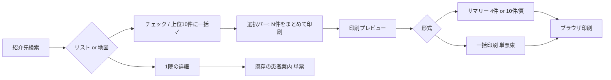

# デザイン案: 逆紹介候補のまとめ印刷

> 対象: foro 連携マップ  
> 目的: 仮説検証ヒアリング用（軽量ワイヤー）  
> 作成日: 2026-07-14  
> 更新日: 2026-07-26（ヒアリング反映）  
> 要件: [要件_逆紹介候補先まとめ印刷.md](../2_discovery/要件_逆紹介候補先まとめ印刷.md)  
> ワイヤー（ai-prototype / 本線）: `/Users/junyamada/ws/ai-prototype/samples/renkei-map-batch-print/renkei-map-batch-print.html`  
> ワイヤー（軽量）: `Flow/202607/2026-07-26/Product_連携マップデザイン作成/wireframes_まとめ印刷_v2.html`  
> ヒアリングメモ: `Flow/202607/2026-07-26/Product_連携マップデザイン作成/ヒアリング結果_まとめ印刷.md`

---

## 結論（推奨案）

**検索結果から複数選択 → 印刷プレビューで「サマリー印刷」と「一括印刷（単票束）」を切替。**  
サマリーはワイヤー段階で **4件/頁** と **10件/頁** の両方を置き、最終はどちらかに寄せる。

| 判断 | 理由 |
|------|------|
| サマリーと一括の両方 | ヒアリング: 若年層はサマリー、高齢層（例: ひとり暮らし）は単票束が必要 |
| サマリー4件と10件を併置 | 最終は一方に決めるが、ワイヤーで密度・可読性を比較議論する |
| 10件版は地図なし・QRあり | 1枚に寄せるため容量削減。名/住所/TEL/交通アクセス/駐車場。フォントは落とさない |
| 「上位10件に一括✓」 | 新東京: 住所検索・近い順・上から案内。効率と標準化のため |
| 選択はリスト・地図サイドのチェック | ピンクリックは既存 InfoWindow のまま |
| 既存「患者案内」導線は残す | 1院確定時の詳細から単票を出す流れは現状維持 |

---

## ヒアリング反映（2026-07-26）

| 要望 | 対応 |
|------|------|
| サマリー印刷と一括印刷の両方欲しい | プレビューで形式切替（サマリー / 一括＝単票束） |
| サマリーは若年向け・なるべく1枚 | 10件/頁案を追加（名/住所/TEL/交通アクセス/駐車場 + QR、地図なし） |
| 高齢層には施設数ぶんの単票 | 一括印刷（N件＝N枚）を併存 |
| 上位10施設に一括✓ | 検索結果にボタン追加 |
| 4件版 | **変更なし**（ワイヤー比較用に維持） |

用途の目安:

| 形式 | 主な対象 | イメージ |
|------|----------|----------|
| **サマリー印刷** | Web等で詳細を自分で確認できる層 | 候補を1枚（または少数枚）で渡す |
| **一括印刷（単票束）** | 高齢層など、何をどうすればよいか分かりやすい情報が必要 | 10施設なら10枚 |

---

## ユーザーフロー（推奨）

---

## 案の比較（初期検討の経緯）

### 案A: 複数選択 → サマリー印刷

検索（リスト/地図）でチェック → まとめ印刷。既存の患者案内（単票）は併存。

**Pros**: 印刷枚数が少ない / 比較・持ち帰り向き / フローが短い  
**Cons**: 1件あたりの情報量が単票より薄い（→ 一括印刷で補完）

### 案B: 複数選択 → 既存患者案内を連続印刷（＝一括印刷）

選択N件の単票を1ジョブでN枚。高齢層向けにヒアリングで再評価され、サマリーと**併存**する方針に更新。

### 案C: 「印刷用に追加」トレイ方式

ページ跨ぎに強いが一手増える。現状は案Aの検索結果選択を採用（トレイは見送り）。

---

## 画面詳細

### 1. 選択UI

- **リスト**: 行左端にチェック。行クリックは従来どおり詳細へ。チェックは別操作（誤タップ防止）
- **地図**: サイドパネルの施設行にも同じチェック。マップ上の選択ピンはチェック同期
  - ※ピンクリック自体は既存どおり InfoWindow。**選択操作は左リストのチェックのみ**
- **上位10件に一括**（NEW）
  - リスト左端のチェックと同じ形・同じ列に配置（右のボタンではなく、行チェックの上に置く）
  - オンで検索結果の並び（近い順など）の上から最大10件を一括チェック／オフで選択解除
  - リスト・地図サイドの両方に置く
  - 根拠: 新東京は住所検索のみ利用し、近い順の上から案内している
  - 結果が10件未満のときは全件チェック
  - 挙動の詳細:
    - 一括チェック後も、**11件目以降を個別に追加チェックできる**（上限100件まで）
    - 11件以上選択した状態で一括チェックを外すと、**11件目以降も含め全件のチェックが外れる**
    - 一括チェックの表示は「上位10件がすべて選択されているか」で同期（追加選択があってもオンのまま）
- **選択バー**（画面下部固定）
  - 「N件選択中」
  - 主要CTA:「まとめて印刷」
  - 「選択解除」は置かない（一括チェックオフ、または個別チェック外しで解除）
  - 0件時はバー非表示 or CTA無効
- **件数上限（案）**: **100件**。超過時はアラート（議論で確定）

### 2. 印刷プレビュー（形式切替）

プレビュー画面上部で印刷形式を切替可能にする。

| 形式 | 内容 | 枚数目安 | ワイヤー |
|------|------|----------|----------|
| **サマリー 4件/頁** | 要約カード。地図（縮小）+ QR + アクセス等 | 選択÷4（切り上げ） | 変更なし |
| **サマリー 10件/頁** | 行リスト。名/住所/TEL/交通アクセス/駐車場 + QR。**地図なし** | 選択÷10（切り上げ） | NEW |
| **一括印刷（単票 1件/頁）** | 既存「患者案内」相当を選択件数分 | 選択件数ぶん | 併存 |

※サマリーの4件/10件は最終どちらかに寄せる。ワイヤーでは両方見せて議論する。

#### サマリー 4件/頁（変更なし）

| 優先 | 項目 | 根拠 |
|------|------|------|
| Must | 医療機関名 | 必須 |
| Must | 電話番号 | 予約・確認 |
| Must | 住所 | 来院 |
| Must | 地図（縮小）または Google Maps QR | がん研: 地図不足が指摘 |
| Should | 交通アクセス（1〜2行） | 持ち帰り検討 |
| Should | 駐車場 あり/なし | 単票にもある |
| Should | 予約診療 あり/なし | 単票にもある |
| No | 逆紹介数 | VoC: 患者向けには不要／過情報 |

#### サマリー 10件/頁（NEW）

| 優先 | 項目 | 根拠 |
|------|------|------|
| Must | 医療機関名 | 必須 |
| Must | 電話番号 | 予約・確認 |
| Must | 住所 | 来院 |
| Must | 交通アクセス | 来院導線 |
| Must | 駐車場 | 来院手段の判断 |
| Must | Google Maps QR | 地図なしの代わり。詳細はWeb等で確認する層向け |
| No | 施設ごとの個別マップ | 容量削減のため載せない |
| No | 予約診療・休診など | 情報を削り1枚10件・フォント維持 |

制約:
- **A4 1ページに最大10件**をほぼ全面で配分（行を均等に伸ばし、詰まりすぎない行間）
- 左右余白は **約8mm** に抑え、長い住所向けに本文幅を確保（住所は最大2行まで折り返し可）
- QRは誤認識しにくいよう **大きめ＋周囲余白（クワイエットゾーン）** を確保。行右端に独立配置
- 本文は極端に小さくしない（施設名/TEL おおよそ14px、住所・アクセス 12px目安）
- ヒアリングで出た「地図上に番号＋施設名列挙（メディグル方式）」は、10件版では地図なしを採用。必要なら別バリエーションとして検討可

#### 一括印刷（単票 1件/頁）

既存患者案内レイアウトを再利用（施設名 / TEL・FAX / 住所 / 予約・駐車場 / アクセス / 地図+QR / 診療時間）。選択N件をまとめて1ジョブで出す。

フッター共通:
- 「最新の診療時間・休診は事前にご確認ください」
- 院内向け統計は載せない

### 3. 使い分け（併存方針）

| 場面 | 使うもの |
|------|----------|
| 候補を複数渡し、自分で詳細確認できる層 | **サマリー印刷**（4件 or 10件） |
| 高齢層など、行動が分かる情報が必要 | **一括印刷（単票束）** |
| 1院に決まった / 詳しく渡したい | **既存 患者案内**（詳細画面から） |
| さらに詳細（レガシー） | **患者案内（詳細版）** |

UIコピー案（詳細画面のボタン群）:
- 患者案内 … 変更なし
- 案Aでは検索結果からのみ複数選択し、詳細には「印刷用リストに追加」を増やさない

---

## 残論点（ワイヤー議論用）

1. サマリーは **4件/頁** と **10件/頁** のどちらかに寄せるか（密度・フォント・渡しやすさ）
2. 10件版のQR配置は行右端で足りるか
3. 「上位10件に一括✓」の件数固定でよいか
4. サマリー / 一括の使い分けを画面コピーで明示するか

---

## 次のステップ

1. ワイヤー v2 で 4件 vs 10件・上位10件✓ を関係者に見せて最終寄せ
2. 件数上限・デフォルト印刷形式を確定 → プロトタイプ精度を上げる
3. 実装見積（選択状態 / 上位N一括 / 印刷CSS / QR）
